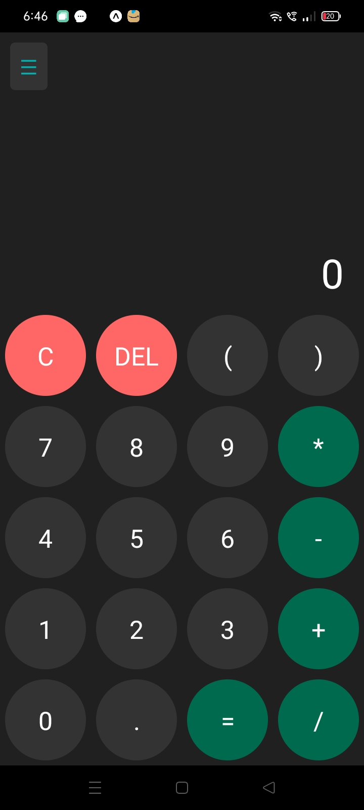
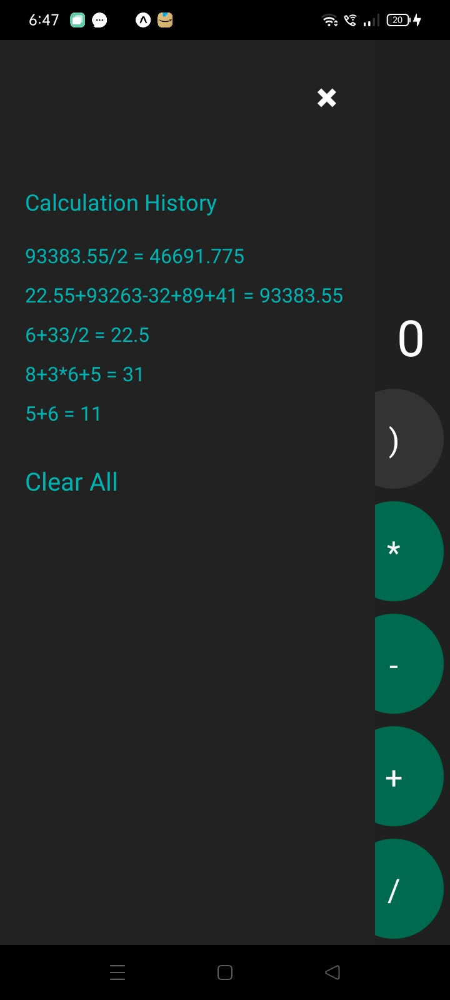

Here’s a `README.md` file template you can use for your Calculator React Native project on GitHub:

---

# Calculator App


A simple, intuitive calculator application built using **React Native**. This app provides basic arithmetic operations along with the ability to maintain a history of calculations.

## Features
- Basic arithmetic operations (Addition, Subtraction, Multiplication, Division)
- View the last 10 calculations history
- Clear all history functionality
- Responsive design with a dark theme
- MongoDB backend integration to store and retrieve calculations

## Screenshots
### Main Calculator Interface


### Calculation History

## Technologies Used
### Frontend
- **React Native**: To build the mobile interface of the app.
- **Expo**: Used for easier development and testing.
  
### Backend
- **Node.js**: To handle the backend server and API requests.
- **Express.js**: For routing and middleware handling.
- **MongoDB**: For storing calculation history in a database.
- **Mongoose**: To connect and interact with MongoDB.

## Prerequisites

Ensure you have the following installed on your machine:
- **Node.js** (>= v14.0.0)
- **npm** or **yarn** (for managing dependencies)
- **Expo CLI** (for running React Native projects)
- **MongoDB** (for backend database)

## Installation

1. **Clone the repository**:
    ```bash
    git clone https://github.com/your-username/calculator-app.git
    cd calculator-app
    ```

2. **Install dependencies**:
    For the **frontend**:
    ```bash
    cd frontend
    npm install
    ```
    
    For the **backend**:
    ```bash
    cd backend
    npm install
    ```

3. **Setup Environment Variables**:

    In the **backend** folder, create a `.env` file and add your MongoDB connection string:
    ```bash
    MONGO_URI=your_mongodb_uri
    PORT=5000
    ```

4. **Run the Backend**:
    ```bash
    cd backend
    node index.js
    ```
    
5. **Run the Frontend**:
    Use Expo to run the app:
    ```bash
    cd frontend
    expo start
    ```

## Usage

- **Frontend**: Use your mobile phone with Expo Go installed or an emulator to run the React Native app.
- **Backend**: The server will run on `http://localhost:5000`, connecting to your MongoDB database to store and retrieve calculations.

## How It Works

1. Perform basic arithmetic operations using the calculator interface.
2. All calculations are evaluated using JavaScript’s `Calculation()` constructor to ensure security.
3. The backend stores the  calculations in a MongoDB database and serves it through the `/history` endpoint.
4. The frontend fetches this history and displays it in a sidebar accessible from the calculator.


